03\_data-analysis-with-Phyloseq
================

  - [Tutoriel PhyloSeq](#tutoriel-phyloseq)
      - [Importaion des librairies et installation des packages
        nécessaire pour le fonctionnement des opérations
        suivantes](#importaion-des-librairies-et-installation-des-packages-nécessaire-pour-le-fonctionnement-des-opérations-suivantes)
      - [Importation des données](#importation-des-données)
      - [Filtration taxonomique](#filtration-taxonomique)
      - [Filtration des prévalences](#filtration-des-prévalences)
      - [Agglomération des taxons](#agglomération-des-taxons)
      - [Comparaison données non filtrées, agglomération taxonomique et
        agglomération
        phylogénique](#comparaison-données-non-filtrées-agglomération-taxonomique-et-agglomération-phylogénique)
      - [Group plots together (différents type
        d’agglo)](#group-plots-together-différents-type-dagglo)
      - [Transformation des valeurs
        d’abondance](#transformation-des-valeurs-dabondance)
      - [Taxonomie des sous-ensembles](#taxonomie-des-sous-ensembles)
      - [Prétraitement des données](#prétraitement-des-données)
      - [Histograms comparing raw and log transformed read
        depths](#histograms-comparing-raw-and-log-transformed-read-depths)
      - [Analyse d’ordination avec l’abondance de
        log](#analyse-dordination-avec-labondance-de-log)
      - [Montrer la dominance d’un seul ASV chez les souris
        aberrantes](#montrer-la-dominance-dun-seul-asv-chez-les-souris-aberrantes)
  - [Différentes projections
    d’ordinations](#différentes-projections-dordinations)
      - [PCoA Bray-Curtis entre
        échantillons](#pcoa-bray-curtis-entre-échantillons)
      - [DPCoA : nouvelles informations phylogénétique (double)
        Visualisation des échantillons et catégories
        taxonomiques](#dpcoa-nouvelles-informations-phylogénétique-double-visualisation-des-échantillons-et-catégories-taxonomiques)
      - [Taxon responsable de l’axe 1 et
        2](#taxon-responsable-de-laxe-1-et-2)
      - [Positions des échantillons produits par PCoA utilisant weighted
        UniFrac](#positions-des-échantillons-produits-par-pcoa-utilisant-weighted-unifrac)
      - [Analyse en Composantes Principales sur les
        rangs](#analyse-en-composantes-principales-sur-les-rangs)
      - [Transformation de données PCA (réduit les
        dimensions)](#transformation-de-données-pca-réduit-les-dimensions)
      - [Donne graphe après troncation de certains
        rangs](#donne-graphe-après-troncation-de-certains-rangs)
      - [Cannonical correspondance (CCpnA) : ordination d’espèces par
        table d’échantillons \> ajoute infos
        supplémentaires](#cannonical-correspondance-ccpna-ordination-despèces-par-table-déchantillons-ajoute-infos-supplémentaires)
  - [Supervisation de l’apprentissage](#supervisation-de-lapprentissage)
      - [Prédiction de l’âge des souris](#prédiction-de-lâge-des-souris)
      - [Prédiction de l’âge de fôret
        aléatoire](#prédiction-de-lâge-de-fôret-aléatoire)
      - [Différentes bactéries en fonction de
        l’âge](#différentes-bactéries-en-fonction-de-lâge)
      - [How frequently sample occur in the same tree partition in the
        random forest’s bootstrapping
        procedure](#how-frequently-sample-occur-in-the-same-tree-partition-in-the-random-forests-bootstrapping-procedure)
      - [Abondance discriminative des bactéries dans des échantillons
        d’arbres à des âges
        différents](#abondance-discriminative-des-bactéries-dans-des-échantillons-darbres-à-des-âges-différents)
  - [Analyses graphiques](#analyses-graphiques)
      - [Création et traçage des graphiques : où viennent les souris, de
        quel
        échantillon…](#création-et-traçage-des-graphiques-où-viennent-les-souris-de-quel-échantillon)
      - [Graphiques basées sur le test de deux échantillons : Minimum
        Spanning Tree
        (MST)](#graphiques-basées-sur-le-test-de-deux-échantillons-minimum-spanning-tree-mst)
      - [Nearest neighbors : if a pair of samples has an edge between
        them in the nearest neighbor graph, they are overwhelmingly
        likely to be in the same
        litter](#nearest-neighbors-if-a-pair-of-samples-has-an-edge-between-them-in-the-nearest-neighbor-graph-they-are-overwhelmingly-likely-to-be-in-the-same-litter)
      - [Modélisation linéaire: Diversité de Shannon associé à chaque
        échantillon et joint avec annotation de
        l’échantillon](#modélisation-linéaire-diversité-de-shannon-associé-à-chaque-échantillon-et-joint-avec-annotation-de-léchantillon)
      - [Hiéarchisation des tests
        multiples](#hiéarchisation-des-tests-multiples)
      - [DESeq2 transformation
        abondance](#deseq2-transformation-abondance)
      - [Correction p-value](#correction-p-value)
      - [Show a screenshot of a subtree with many differentially
        abundant bacteria, as determined by the hierarchical testing
        procedure.](#show-a-screenshot-of-a-subtree-with-many-differentially-abundant-bacteria-as-determined-by-the-hierarchical-testing-procedure.)
  - [Utilisation des multi-tables](#utilisation-des-multi-tables)

# Tutoriel PhyloSeq

## Importaion des librairies et installation des packages nécessaire pour le fonctionnement des opérations suivantes

``` r
library("knitr")
library("BiocStyle")
library("phyloseq")
library("ggplot2")
.cran_packages <- c("ggplot2", "gridExtra")
.bioc_packages <- c("dada2", "phyloseq", "DECIPHER", "phangorn")
.inst <- .cran_packages %in% installed.packages()
if(any(!.inst)) {
   install.packages(.cran_packages[!.inst])
}
.inst <- .bioc_packages %in% installed.packages()
if(any(!.inst)) {
   source("http://bioconductor.org/biocLite.R")
   biocLite(.bioc_packages[!.inst], ask = F)
}
sapply(c(.cran_packages, .bioc_packages), require, character.only = TRUE)
```

    ## Loading required package: gridExtra

    ## Loading required package: dada2

    ## Loading required package: Rcpp

    ## Loading required package: DECIPHER

    ## Loading required package: Biostrings

    ## Loading required package: BiocGenerics

    ## Loading required package: parallel

    ## 
    ## Attaching package: 'BiocGenerics'

    ## The following objects are masked from 'package:parallel':
    ## 
    ##     clusterApply, clusterApplyLB, clusterCall, clusterEvalQ,
    ##     clusterExport, clusterMap, parApply, parCapply, parLapply,
    ##     parLapplyLB, parRapply, parSapply, parSapplyLB

    ## The following object is masked from 'package:gridExtra':
    ## 
    ##     combine

    ## The following objects are masked from 'package:stats':
    ## 
    ##     IQR, mad, sd, var, xtabs

    ## The following objects are masked from 'package:base':
    ## 
    ##     anyDuplicated, append, as.data.frame, basename, cbind, colnames,
    ##     dirname, do.call, duplicated, eval, evalq, Filter, Find, get, grep,
    ##     grepl, intersect, is.unsorted, lapply, Map, mapply, match, mget,
    ##     order, paste, pmax, pmax.int, pmin, pmin.int, Position, rank,
    ##     rbind, Reduce, rownames, sapply, setdiff, sort, table, tapply,
    ##     union, unique, unsplit, which.max, which.min

    ## Loading required package: S4Vectors

    ## Loading required package: stats4

    ## 
    ## Attaching package: 'S4Vectors'

    ## The following object is masked from 'package:base':
    ## 
    ##     expand.grid

    ## Loading required package: IRanges

    ## 
    ## Attaching package: 'IRanges'

    ## The following object is masked from 'package:phyloseq':
    ## 
    ##     distance

    ## Loading required package: XVector

    ## 
    ## Attaching package: 'Biostrings'

    ## The following object is masked from 'package:base':
    ## 
    ##     strsplit

    ## Loading required package: RSQLite

    ## Loading required package: phangorn

    ## Loading required package: ape

    ## 
    ## Attaching package: 'ape'

    ## The following object is masked from 'package:Biostrings':
    ## 
    ##     complement

    ##   ggplot2 gridExtra     dada2  phyloseq  DECIPHER  phangorn 
    ##      TRUE      TRUE      TRUE      TRUE      TRUE      TRUE

Chargement des différents packages nécessaires pour le travail sur
PhyloSeq NB : les packages sont laissés ici pour éviter les mauvaises
surprises (packages introuvables…)

## Importation des données

``` r
ps_connect <-url("https://raw.githubusercontent.com/spholmes/F1000_workflow/master/data/ps.rds")
ps = readRDS(ps_connect)
ps
```

    ## phyloseq-class experiment-level object
    ## otu_table()   OTU Table:         [ 389 taxa and 360 samples ]
    ## sample_data() Sample Data:       [ 360 samples by 14 sample variables ]
    ## tax_table()   Taxonomy Table:    [ 389 taxa by 6 taxonomic ranks ]
    ## phy_tree()    Phylogenetic Tree: [ 389 tips and 387 internal nodes ]

On importe les données déjà traitées par dada2. Ce ne sont pas les
données du fichier 02 avec Dada2.

## Filtration taxonomique

``` r
rank_names(ps)
```

    ## [1] "Kingdom" "Phylum"  "Class"   "Order"   "Family"  "Genus"

On montre les différents rangs présent dans le jeu de donnée ps.

``` r
table(tax_table(ps)[, "Phylum"], exclude = NULL)
```

    ## 
    ##              Actinobacteria               Bacteroidetes 
    ##                          13                          23 
    ## Candidatus_Saccharibacteria   Cyanobacteria/Chloroplast 
    ##                           1                           4 
    ##         Deinococcus-Thermus                  Firmicutes 
    ##                           1                         327 
    ##                Fusobacteria              Proteobacteria 
    ##                           1                          11 
    ##                 Tenericutes             Verrucomicrobia 
    ##                           1                           1 
    ##                        <NA> 
    ##                           6

Création d’une table. On peut voir pour certains phylums, une seule
souche a été identifiée.

``` r
ps <- subset_taxa(ps, !is.na(Phylum) & !Phylum %in% c("", "uncharacterized"))
```

On retire les phylums dits ambigues, ie que ce sont peut-être des
artefacts Ils peuvent influencer sur la suite des oprétaions donc ils
doivent être retirés

``` r
prevdf = apply(X = otu_table(ps),
               MARGIN = ifelse(taxa_are_rows(ps), yes = 1, no = 2),
               FUN = function(x){sum(x > 0)})
```

On détermine la prévalence, ie le nombre de fois où un échantillon est
au moins une fois présent dans un des taxons. Pour cette ligne de code,
on détermine leur prévalence dans les phylums

``` r
prevdf = data.frame(Prevalence = prevdf,
                    TotalAbundance = taxa_sums(ps),
                    tax_table(ps))
```

Pour les prévalences des phylums obtenues, une taxonomie, ainsi que le
nombre total de read, ont été ajoutés

``` r
plyr::ddply(prevdf, "Phylum", function(df1){cbind(mean(df1$Prevalence),sum(df1$Prevalence))})
```

    ##                         Phylum         1     2
    ## 1               Actinobacteria 120.15385  1562
    ## 2                Bacteroidetes 265.52174  6107
    ## 3  Candidatus_Saccharibacteria 280.00000   280
    ## 4    Cyanobacteria/Chloroplast  64.25000   257
    ## 5          Deinococcus-Thermus  52.00000    52
    ## 6                   Firmicutes 179.24771 58614
    ## 7                 Fusobacteria   2.00000     2
    ## 8               Proteobacteria  59.09091   650
    ## 9                  Tenericutes 234.00000   234
    ## 10             Verrucomicrobia 104.00000   104

Ici, on calcul la prévalence totale (colonne 2) et prévalence moyenne
(colonne 1) de chaque échantillon dans chacun des phylums. Par exemple,
pour Fusobacteria, le total et la moyenne sont égaux, ie qu’il est deux
fois dans le même échantillon. Pour Proteobacteria, on en dénombre 650.
Si on divise par la prévalence moyenne, on obtient environ 11. Il est
donc présent dans 11 échantillons différents.

``` r
filterPhyla = c("Fusobacteria", "Deinococcus-Thermus")
```

On définit les phylums à filtrer

``` r
ps1 = subset_taxa(ps, !Phylum %in% filterPhyla)
ps1
```

    ## phyloseq-class experiment-level object
    ## otu_table()   OTU Table:         [ 381 taxa and 360 samples ]
    ## sample_data() Sample Data:       [ 360 samples by 14 sample variables ]
    ## tax_table()   Taxonomy Table:    [ 381 taxa by 6 taxonomic ranks ]
    ## phy_tree()    Phylogenetic Tree: [ 381 tips and 379 internal nodes ]

On filtre les données, ie qu’on retire les phylums que l’on a décrit
juste avant.

## Filtration des prévalences

``` r
prevdf1 = subset(prevdf, Phylum %in% get_taxa_unique(ps1, "Phylum"))
ggplot(prevdf1, aes(TotalAbundance, Prevalence / nsamples(ps),color=Phylum)) +
  geom_hline(yintercept = 0.05, alpha = 0.5, linetype = 2) +  geom_point(size = 2, alpha = 0.7) +
  scale_x_log10() +  xlab("Total Abundance") + ylab("Prevalence [Frac. Samples]") +
  facet_wrap(~Phylum) + theme(legend.position="none")
```

<!-- -->
Graphe représentant la prévalence des taxons en fonction de l’abondance
totale (cela permet de mettre en évidence des valeurs aberrantes qui
doivent être supprimées). Un point représente un taxon. Certains taxons
sont plus présents que d’autres (cf Firmicutes). Il convient de poser un
seuil de prévalence car la mjorité des taxons sont supérieurs à 10%

``` r
prevalenceThreshold = 0.05 * nsamples(ps)
prevalenceThreshold
```

    ## [1] 18

On pose un seuil de prévalence à 5%. Les taxons qui se trouvaient en
dessous de ce seuil ont été enlevés. 18 taxons vont être retirés lors de
l’application du seuil de prévalence.

``` r
keepTaxa = rownames(prevdf1)[(prevdf1$Prevalence >= prevalenceThreshold)]
ps2 = prune_taxa(keepTaxa, ps)
```

On applique le seuil de prévalence de 5%, retirant les 18 taxons se
trouvant en dessous de cette limite. ps2 regroupe les taxons après ce
filtrage.

## Agglomération des taxons

``` r
length(get_taxa_unique(ps2, taxonomic.rank = "Genus"))
```

    ## [1] 49

Après filtrage, 49 genres pourront être visualisés

``` r
ps3 = tax_glom(ps2, "Genus", NArm = TRUE)
```

On applique à ps3, l’agglomération des genres venant de ps2. Toutes les
caractéristiques fonctionnelles que l’on retrouvait souvent dans les
données ont été regroupées ensemble.

``` r
h1 = 0.4
ps4 = tip_glom(ps2, h = h1)
```

h1 représente la hauteur d’arbre qui définit la distance phylogénétique
entre les différentes caractéristiques. On applique à ps4 cette distance
phylogénétique. A la différence de ps2, on s’intéresse ici à une
agglomération sans prendre en compte la taxonomie, donc une
agglomération phylogénétique.

## Comparaison données non filtrées, agglomération taxonomique et agglomération phylogénique

``` r
multiPlotTitleTextSize = 15
p2tree = plot_tree(ps2, method = "treeonly",
                   ladderize = "left",
                   title = "Before Agglomeration") +
  theme(plot.title = element_text(size = multiPlotTitleTextSize))
p3tree = plot_tree(ps3, method = "treeonly",
                   ladderize = "left", title = "By Genus") +
  theme(plot.title = element_text(size = multiPlotTitleTextSize))
p4tree = plot_tree(ps4, method = "treeonly",
                   ladderize = "left", title = "By Height") +
  theme(plot.title = element_text(size = multiPlotTitleTextSize))
```

On stocke les données préparées auapravant dans les ptree qui leurs sont
associées pour pouvoir obtenir un graphe permettant de les comparer
entre eux.

## Group plots together (différents type d’agglo)

``` r
gridExtra::grid.arrange(nrow = 1, p2tree, p3tree, p4tree)
```

<!-- -->
On peut voir que l’agglomération par genre et par la distance
phylogénétique améliore la lisibilité des données. On a un meilleur
aperçu de la répartition des communautés présents dans les échantillons.

## Transformation des valeurs d’abondance

``` r
plot_abundance = function(physeq,title = "",
                          Facet = "Order", Color = "Phylum"){
  p1f = subset_taxa(physeq, Phylum %in% c("Firmicutes"))
  mphyseq = psmelt(p1f)
  mphyseq <- subset(mphyseq, Abundance > 0)
  ggplot(data = mphyseq, mapping = aes_string(x = "sex",y = "Abundance",
                              color = Color, fill = Color)) +
    geom_violin(fill = NA) +
    geom_point(size = 1, alpha = 0.3,
               position = position_jitter(width = 0.3)) +
    facet_wrap(facets = Facet) + scale_y_log10()+
    theme(legend.position="none")
}
```

Tout d’abord, on définit une fonction qui va utiliser phyloseq pour
définir un graphique d’abondance relative. Cela va nous permettre de
comparer ces valeurs avec les abondances dans leur échelle et leur
distribution.

``` r
ps3ra = transform_sample_counts(ps3, function(x){x / sum(x)})
```

Transformation des données en abondane relative

``` r
plotBefore = plot_abundance(ps3,"")
plotAfter = plot_abundance(ps3ra,"")
```

On affecte ps3 (avant transformation) et ps3ra (après transformation en
abondance relative) à deux datas plot

``` r
gridExtra::grid.arrange(nrow = 2,  plotBefore, plotAfter)
```

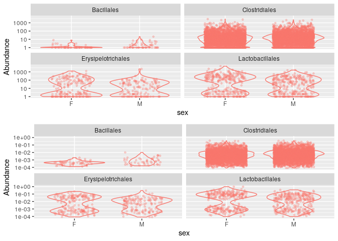<!-- -->
Affichage des graphes avant et après transformations. En haut, nous
avons les graphes d’abondances originales et en bas les graphes
d’abondances relatives. On peut voir des similitudes entre les deux
sexes, notamment pour Erysipelotrichales et Lactobacillales. On observe
chez ces derniers, deux endroits sur le graphe où on oberve plusieurs
taxons (élargissement des figures). En observant l’abondance relative,
on peut voir une abondance plus importante que les abondances
originalles (soit absolue). Ces abondances relatives sont obtenus en
divisant le nombre de fois que les taxons sont observés dans l’ensemble
de tous les taxons. Ces valeurs doivent être interprétées avec
attention. Par exemple, si la population augmente mais que la population
ne bouge pas, son abondance relative diminue. Cette abondance sert
plutôt à donner un aperçu de la diversité de la communauté.

## Taxonomie des sous-ensembles

``` r
psOrd = subset_taxa(ps3ra, Order == "Lactobacillales")
plot_abundance(psOrd, Facet = "Genus", Color = NULL)
```

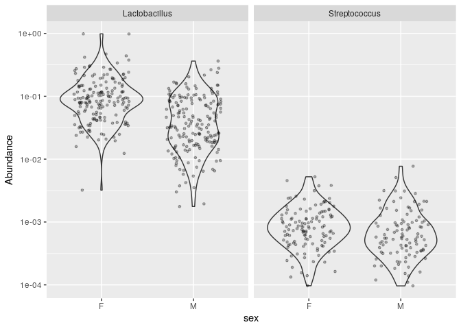<!-- -->
On s’est demandé ce qui pouvait expliquer l’abondance de plusieurs en
taxons au deux endroits du graphe. On examine par ce code les
sous-ensembles des Lactobacillales. On observe des Lactobacillus et
Streptococcus, deux familles de bactéries qui prédominent chez
Lactobacillales dans ces échantillons. On observe une plus grande
abondance des Lactobacillus que de Streptococcus.

## Prétraitement des données

``` r
qplot(sample_data(ps)$age, geom = "histogram",binwidth=20) + xlab("age")
```

<!-- -->
Il s’agit d’un histogramme montrant le nombre de souris en fonction de
leur âge (en jours). On observe 3 pics où les âges sont différents :
jeune, moyen at âgé

## Histograms comparing raw and log transformed read depths

``` r
qplot(log10(rowSums(otu_table(ps))),binwidth=0.2) +
  xlab("Logged counts-per-sample")
```

<!-- -->
Sur ce graph, on compare les reads brutes et les reads en log. Cela
permet de déterminer quel log employer pour permettre d’affiner les
résultats pour la PCoa.

## Analyse d’ordination avec l’abondance de log

``` r
sample_data(ps)$age_binned <- cut(sample_data(ps)$age,
                          breaks = c(0, 100, 200, 400))
levels(sample_data(ps)$age_binned) <- list(Young100="(0,100]", Mid100to200="(100,200]", Old200="(200,400]")
sample_data(ps)$family_relationship=gsub(" ","",sample_data(ps)$family_relationship)
pslog <- transform_sample_counts(ps, function(x) log(1 + x))
out.wuf.log <- ordinate(pslog, method = "MDS", distance = "wunifrac")
```

    ## Warning in UniFrac(physeq, weighted = TRUE, ...): Randomly assigning root as --
    ## GCAAGCGTTATCCGGATTTACTGGGTGTAAAGGGCGTGTAGGCGGGCATGCAAGCCAGAAGTGAAATCTGGGGGCTTAACCCCCAAACTGCTTTTGGAACTGCGTGTCTTGAGTGATGGAGAGGCAGGCGGAATTCCCAGTGTAGCGGTGAAATGCGTAGATATTGGGAGGAACACCAGTGGCGAAGGCGACCTGCTGGACATTAACTGACGCTGAGGCGCGAAAGCGTGGGGAG
    ## -- in the phylogenetic tree in the data you provided.

``` r
evals <- out.wuf.log$values$Eigenvalues
plot_ordination(pslog, out.wuf.log, color = "age_binned") +
  labs(col = "Binned Age") +
  coord_fixed(sqrt(evals[2] / evals[1]))
```

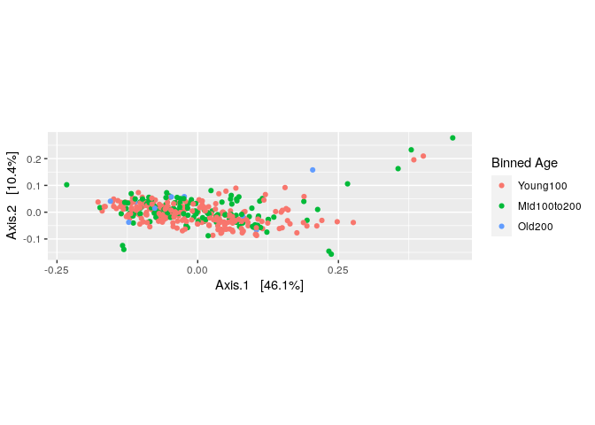<!-- -->
On effectue une PCoA en utilisant Bray-Curtis pour mesurer la
dissimilarité entre les échantillons. On observe que la majeure partie
des souris ne présentent pas de différence avec leur âge. Cependant,
certaines valeurs sont aberrantes (2 femelles et 4 mâles), il faut donc
les retirer.

## Montrer la dominance d’un seul ASV chez les souris aberrantes

``` r
rel_abund <- t(apply(otu_table(ps), 1, function(x) x / sum(x)))
qplot(rel_abund[, 12], geom = "histogram",binwidth=0.05) +
  xlab("Relative abundance")
```

<!-- -->
En analysant les 2 souris femelles aberrantes, il a été constaté qu’un
ASV prédominait (90%) par rapport aux autres. Chez les autres souris,
cet ASV repésente moins de 20%. Le fait de retirer ces souris vont
permettre de donner des résultats plus fiables pour la suite.

# Différentes projections d’ordinations

``` r
outliers <- c("F5D165", "F6D165", "M3D175", "M4D175", "M5D175", "M6D175")
ps <- prune_samples(!(sample_names(ps) %in% outliers), ps)
```

On affecte les valeurs aberrantes à “outliers”. On indique à ps les
valeurs aberrantes à retirer.

``` r
which(!rowSums(otu_table(ps)) > 1000)
```

    ## F5D145 M1D149   M1D9 M2D125  M2D19 M3D148 M3D149   M3D3   M3D5   M3D8 
    ##     69    185    200    204    218    243    244    252    256    260

Prélévements où il y a dse échantillons avec moins de 1000 reads.

``` r
ps <- prune_samples(rowSums(otu_table(ps)) > 1000, ps)
pslog <- transform_sample_counts(ps, function(x) log(1 + x))
```

On retire à ps les échantillons ayant moins de 1000 reads et on
transforme les données avec log(x+1) pour affiner les résultats

## PCoA Bray-Curtis entre échantillons

``` r
out.pcoa.log <- ordinate(pslog,  method = "MDS", distance = "bray")
evals <- out.pcoa.log$values[,1]
plot_ordination(pslog, out.pcoa.log, color = "age_binned",
                  shape = "family_relationship") +
  labs(col = "Binned Age", shape = "Litter")+
  coord_fixed(sqrt(evals[2] / evals[1]))
```

<!-- -->
On observe une forte dissimilarité entre les jeunes souris et les souris
moyennes, qu’elles soient de sexe mâle ou femelle et provenant de deux
litières différentes. L’âge a une influence sur la communauté
microbienne au sein des souris.

## DPCoA : nouvelles informations phylogénétique (double) Visualisation des échantillons et catégories taxonomiques

``` r
out.dpcoa.log <- ordinate(pslog, method = "DPCoA")
evals <- out.dpcoa.log$eig
plot_ordination(pslog, out.dpcoa.log, color = "age_binned", label= "SampleID",
                  shape = "family_relationship") +
  labs(col = "Binned Age", shape = "Litter")+
  coord_fixed(sqrt(evals[2] / evals[1]))
```

<!-- -->
Cette DPCoa ajoute des informations phylogénétiques aux données. Sur
l’axe 1, on observe une variabilité de 75% tandis que sur l’axe 2, on
observe une variabilité de 8,5%. L’axe 2 montre les différences entre
les jeunes souris des souris d’âge moyen, comme précédemment. Les
données phylogénétiques associées aux souris montrent que les taxons
Firmicutes ont une forte abondance chez ces souris, analyses confirmées
par le graphe suivant.

## Taxon responsable de l’axe 1 et 2

``` r
plot_ordination(pslog, out.dpcoa.log, type = "species", color = "Phylum") +
  coord_fixed(sqrt(evals[2] / evals[1]))
```

<!-- -->
Confirmation de la prédominance des Firmicutes.

## Positions des échantillons produits par PCoA utilisant weighted UniFrac

``` r
out.wuf.log <- ordinate(pslog, method = "PCoA", distance ="wunifrac")
```

    ## Warning in UniFrac(physeq, weighted = TRUE, ...): Randomly assigning root as --
    ## GCAAGCGTTATCCGGAATGATTGGGCGTAAAGGGTGCGCAGGCGGAACCATAAGTCTGAAGTAAAAGCCATCGGCTCAACCGATGTAAGCTTTGGAAACTGTGGATCTAGAGTGCAGGAGAGGACAGTGGAATTCCATGTGTAGCGGTAAAATGCGTAGATATATGGAGGAACACCAGTGGCGAAGGCGGCTGTCTGGCCTGTAACTGACGCTGAGGCACGAAAGCGTGGGGAGC
    ## -- in the phylogenetic tree in the data you provided.

``` r
evals <- out.wuf.log$values$Eigenvalues
plot_ordination(pslog, out.wuf.log, color = "age_binned",
                  shape = "family_relationship") +
  coord_fixed(sqrt(evals[2] / evals[1])) +
  labs(col = "Binned Age", shape = "Litter")
```

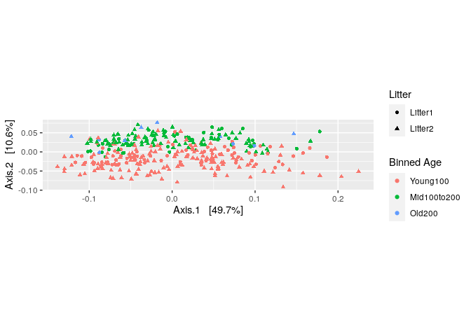<!-- -->
On utilise l’UniFrac pondére pour examiner les résultats donnés par la
PCoA. On peut voir selon l’axe 2, une différence entre les souris d’âge
différent, confirmant la PCoA. Mais la DPCoA a apporté plus
d’informations sur le deuxième axe que n’offre l’UniFrac.

## Analyse en Composantes Principales sur les rangs

``` r
abund <- otu_table(pslog)
abund_ranks <- t(apply(abund, 1, rank))
```

Création d’une matrice qui intégre l’abondance par un rang. La plus
petite bactérie est associé au rang 1, la seconde au rang 2 …. et on
continue jusqu’à avoir associé toutes les bactéries à un rang.

``` r
abund_ranks <- abund_ranks - 329
abund_ranks[abund_ranks < 1] <- 1
```

Certains bactéries sont absentes ou ont une très faible abondance dans
les échantillons (ils peuvent être dans certains échantillons mais
absents dans d’autres). On pose un seuil au niveau des rangs et toutes
les bactéries dont les rangs sont inférieurs au seuil seront attribuées
au rang 1.

## Transformation de données PCA (réduit les dimensions)

``` r
library(dplyr)
```

    ## 
    ## Attaching package: 'dplyr'

    ## The following objects are masked from 'package:Biostrings':
    ## 
    ##     collapse, intersect, setdiff, setequal, union

    ## The following object is masked from 'package:XVector':
    ## 
    ##     slice

    ## The following objects are masked from 'package:IRanges':
    ## 
    ##     collapse, desc, intersect, setdiff, slice, union

    ## The following objects are masked from 'package:S4Vectors':
    ## 
    ##     first, intersect, rename, setdiff, setequal, union

    ## The following objects are masked from 'package:BiocGenerics':
    ## 
    ##     combine, intersect, setdiff, union

    ## The following object is masked from 'package:gridExtra':
    ## 
    ##     combine

    ## The following objects are masked from 'package:stats':
    ## 
    ##     filter, lag

    ## The following objects are masked from 'package:base':
    ## 
    ##     intersect, setdiff, setequal, union

``` r
library(reshape2)
abund_df <- melt(abund, value.name = "abund") %>%
  left_join(melt(abund_ranks, value.name = "rank"))
```

    ## Joining, by = c("Var1", "Var2")

``` r
colnames(abund_df) <- c("sample", "seq", "abund", "rank")

abund_df <- melt(abund, value.name = "abund") %>%
  left_join(melt(abund_ranks, value.name = "rank"))
```

    ## Joining, by = c("Var1", "Var2")

``` r
colnames(abund_df) <- c("sample", "seq", "abund", "rank")

sample_ix <- sample(1:nrow(abund_df), 8)
ggplot(abund_df %>%
         filter(sample %in% abund_df$sample[sample_ix])) +
  geom_point(aes(x = abund, y = rank, col = sample),
             position = position_jitter(width = 0.2), size = 1.5) +
  labs(x = "Abundance", y = "Thresholded rank") +
  scale_color_brewer(palette = "Set2")
```

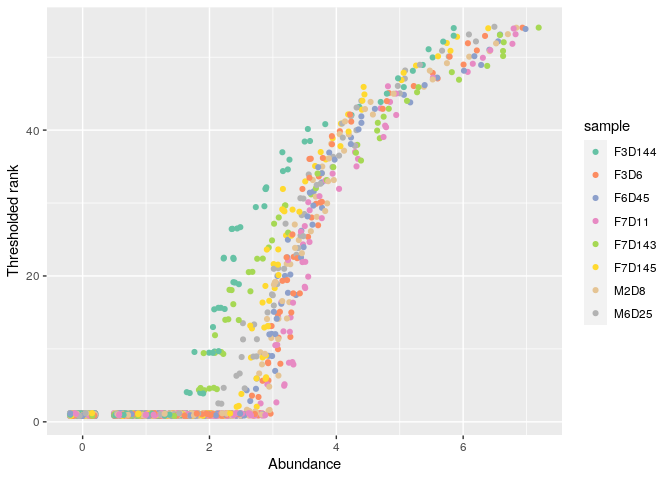<!-- -->
Après transformation (imposé le seuil des rangs). On observe une
varition d’abondance pour de nombreuses bactéries de rang 1. Mais
l’abondance augmente continuellement au fur et à mesure que les rangs
augmentent, et donc que la taille des bactéries augemente.

## Donne graphe après troncation de certains rangs

``` r
library(ade4)
```

    ## 
    ## Attaching package: 'ade4'

    ## The following object is masked from 'package:Biostrings':
    ## 
    ##     score

    ## The following object is masked from 'package:BiocGenerics':
    ## 
    ##     score

``` r
ranks_pca <- dudi.pca(abund_ranks, scannf = F, nf = 3)
row_scores <- data.frame(li = ranks_pca$li,
                         SampleID = rownames(abund_ranks))
col_scores <- data.frame(co = ranks_pca$co,
                         seq = colnames(abund_ranks))
tax <- tax_table(ps) %>%
  data.frame(stringsAsFactors = FALSE)
tax$seq <- rownames(tax)
main_orders <- c("Clostridiales", "Bacteroidales", "Lactobacillales",
                 "Coriobacteriales")
tax$Order[!(tax$Order %in% main_orders)] <- "Other"
tax$Order <- factor(tax$Order, levels = c(main_orders, "Other"))
tax$otu_id <- seq_len(ncol(otu_table(ps)))
row_scores <- row_scores %>%
  left_join(sample_data(pslog))
```

    ## Joining, by = "SampleID"

    ## Warning in class(x) <- c(setdiff(subclass, tibble_class), tibble_class): Setting
    ## class(x) to multiple strings ("tbl_df", "tbl", ...); result will no longer be an
    ## S4 object

``` r
col_scores <- col_scores %>%
  left_join(tax)
```

    ## Joining, by = "seq"

``` r
evals_prop <- 100 * (ranks_pca$eig / sum(ranks_pca$eig))
ggplot() +
  geom_point(data = row_scores, aes(x = li.Axis1, y = li.Axis2), shape = 2) +
  geom_point(data = col_scores, aes(x = 25 * co.Comp1, y = 25 * co.Comp2, col = Order),
             size = .3, alpha = 0.6) +
  scale_color_brewer(palette = "Set2") +
  facet_grid(~ age_binned) +
  guides(col = guide_legend(override.aes = list(size = 3))) +
  labs(x = sprintf("Axis1 [%s%% variance]", round(evals_prop[1], 2)),
       y = sprintf("Axis2 [%s%% variance]", round(evals_prop[2], 2))) +
  coord_fixed(sqrt(ranks_pca$eig[2] / ranks_pca$eig[1])) +
  theme(panel.border = element_rect(color = "#787878", fill = alpha("white", 0)))
```

<!-- -->
On a effectuer une Analyse en Composantes Principales (ACP). Ici, aucune
transformation n’a été faite. On observe une similitude avec la PCoA,
notamment des différences en fonction de l’âge avec l’axe 2 et une
grande dissimilarité des bactéries avec l’axe 1. L’analyse des données
de départ ont bien été réalisée.

## Cannonical correspondance (CCpnA) : ordination d’espèces par table d’échantillons \> ajoute infos supplémentaires

``` r
ps_ccpna <- ordinate(pslog, "CCA", formula = pslog ~ age_binned + family_relationship)
```

On va effectuer une CCpna. Pour cela, il est nécessaire d’ajouter des un
argument, précisant quelles caractéristiques à prendre en compte. Sinon,
on peut utilise toutes les données par défaut.

``` r
library(ggrepel)
ps_scores <- vegan::scores(ps_ccpna)
sites <- data.frame(ps_scores$sites)
sites$SampleID <- rownames(sites)
sites <- sites %>%
  left_join(sample_data(ps))
```

    ## Joining, by = "SampleID"

    ## Warning in class(x) <- c(setdiff(subclass, tibble_class), tibble_class): Setting
    ## class(x) to multiple strings ("tbl_df", "tbl", ...); result will no longer be an
    ## S4 object

``` r
species <- data.frame(ps_scores$species)
species$otu_id <- seq_along(colnames(otu_table(ps)))
species <- species %>%
  left_join(tax)
```

    ## Joining, by = "otu_id"

``` r
evals_prop <- 100 * ps_ccpna$CCA$eig[1:2] / sum(ps_ccpna$CA$eig)
ggplot() +
  geom_point(data = sites, aes(x = CCA1, y = CCA2), shape = 2, alpha = 0.5) +
  geom_point(data = species, aes(x = CCA1, y = CCA2, col = Order), size = 0.5) +
  geom_text_repel(data = species %>% filter(CCA2 < -2),
                    aes(x = CCA1, y = CCA2, label = otu_id),
            size = 1.5, segment.size = 0.1) +
  facet_grid(. ~ family_relationship) +
  guides(col = guide_legend(override.aes = list(size = 3))) +
  labs(x = sprintf("Axis1 [%s%% variance]", round(evals_prop[1], 2)),
        y = sprintf("Axis2 [%s%% variance]", round(evals_prop[2], 2))) +
  scale_color_brewer(palette = "Set2") +
  coord_fixed(sqrt(ps_ccpna$CCA$eig[2] / ps_ccpna$CCA$eig[1])*0.45   ) +
  theme(panel.border = element_rect(color = "#787878", fill = alpha("white", 0)))
```

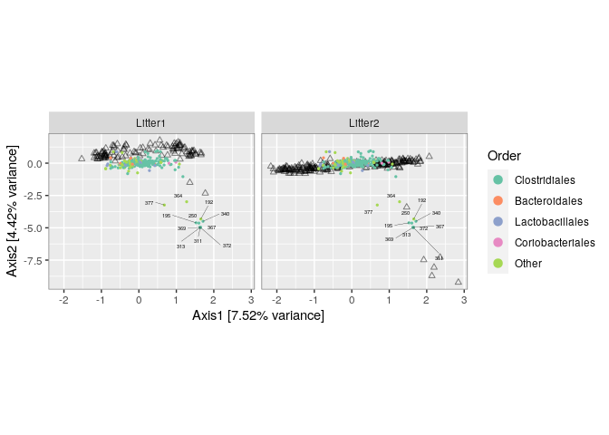<!-- -->
Ce code ne fonctionne pas car il est sensé utiliser les données du site
d’où proviennent les données. On est supposé avoir deux graphiques : le
premier concernant la portée 1, et le second, la portée 2. On aurait
visualiser les quatre taxons les plus abondants parmi les 23 présents.
On aurait également vu sur le premier graphique une nette différence
entre les souris jeunes et plus âgées sur l’axe des ordonnées.

# Supervisation de l’apprentissage

``` r
library(caret)
```

    ## Loading required package: lattice

``` r
sample_data(pslog)$age2 <- cut(sample_data(pslog)$age, c(0, 100, 400))
dataMatrix <- data.frame(age = sample_data(pslog)$age2, otu_table(pslog))
trainingMice <- sample(unique(sample_data(pslog)$host_subject_id), size = 8)
inTrain <- which(sample_data(pslog)$host_subject_id %in% trainingMice)
training <- dataMatrix[inTrain,]
testing <- dataMatrix[-inTrain,]
plsFit <- train(age ~ ., data = training,
                method = "pls", preProc = "center")
```

On divise les données pour former des ensembles dits de formations et de
tests, en faisant des affectations par souris plutôt que par
échantillons.

## Prédiction de l’âge des souris

``` r
plsClasses <- predict(plsFit, newdata = testing)
table(plsClasses, testing$age)
```

    ##            
    ## plsClasses  (0,100] (100,400]
    ##   (0,100]        69         1
    ##   (100,400]       4        45

Prédiction de l’âge des souris (en jours). La prédiction est très bien
faite si on le compare aux données précédement faites. 63 souris ont
etre 0 et 100 jours, et 4 souris ont 100 jours (cf bornes des
intervalles).

## Prédiction de l’âge de fôret aléatoire

``` r
library(randomForest)
```

    ## randomForest 4.6-14

    ## Type rfNews() to see new features/changes/bug fixes.

    ## 
    ## Attaching package: 'randomForest'

    ## The following object is masked from 'package:dplyr':
    ## 
    ##     combine

    ## The following object is masked from 'package:BiocGenerics':
    ## 
    ##     combine

    ## The following object is masked from 'package:gridExtra':
    ## 
    ##     combine

    ## The following object is masked from 'package:ggplot2':
    ## 
    ##     margin

``` r
rfFit <- train(age ~ ., data = training, method = "rf",
               preProc = "center", proximity = TRUE)
rfClasses <- predict(rfFit, newdata = testing)
table(rfClasses, testing$age)
```

    ##            
    ## rfClasses   (0,100] (100,400]
    ##   (0,100]        73         3
    ##   (100,400]       0        43

Autre exemple de classification selon l’âge (en années) des arbres.

## Différentes bactéries en fonction de l’âge

``` r
library(vegan)
```

    ## Loading required package: permute

    ## This is vegan 2.5-6

    ## 
    ## Attaching package: 'vegan'

    ## The following object is masked from 'package:caret':
    ## 
    ##     tolerance

    ## The following objects are masked from 'package:phangorn':
    ## 
    ##     diversity, treedist

``` r
pls_biplot <- list("loadings" = loadings(plsFit$finalModel),
                   "scores" = scores(plsFit$finalModel))
class(pls_biplot$scores) <- "matrix"

pls_biplot$scores <- data.frame(sample_data(pslog)[inTrain, ],
                                pls_biplot$scores)

tax <- tax_table(ps)@.Data %>%
  data.frame(stringsAsFactors = FALSE)
main_orders <- c("Clostridiales", "Bacteroidales", "Lactobacillales",
                 "Coriobacteriales")
tax$Order[!(tax$Order %in% main_orders)] <- "Other"
tax$Order <- factor(tax$Order, levels = c(main_orders, "Other"))
class(pls_biplot$loadings) <- "matrix"
pls_biplot$loadings <- data.frame(tax, pls_biplot$loadings)
ggplot() +
  geom_point(data = pls_biplot$scores,
             aes(x = Comp.1, y = Comp.2), shape = 2) +
  geom_point(data = pls_biplot$loadings,
             aes(x = 25 * Comp.1, y = 25 * Comp.2, col = Order),
             size = 0.3, alpha = 0.6) +
  scale_color_brewer(palette = "Set2") +
  labs(x = "Axis1", y = "Axis2", col = "Binned Age") +
  guides(col = guide_legend(override.aes = list(size = 3))) +
  facet_grid( ~ age2) +
  theme(panel.border = element_rect(color = "#787878", fill = alpha("white", 0)))
```

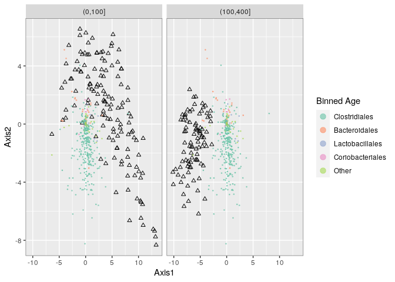<!-- -->
Par l’utilisation de ce graphique, on différencie les bactéries
retrouvées chez les souris en fonction de leur âge. Les axes restent
les mêmes que la PCoA mais la variabilité de l’âge est utilisée comme
référence.

## How frequently sample occur in the same tree partition in the random forest’s bootstrapping procedure

``` r
rf_prox <- cmdscale(1 - rfFit$finalModel$proximity) %>%
  data.frame(sample_data(pslog)[inTrain, ])
ggplot(rf_prox) +
  geom_point(aes(x = X1, y = X2, col = age_binned),
             size = 1, alpha = 0.7) +
  scale_color_manual(values = c("#A66EB8", "#238DB5", "#748B4F")) +
  guides(col = guide_legend(override.aes = list(size = 4))) +
  labs(col = "Binned Age", x = "Axis1", y = "Axis2")
```

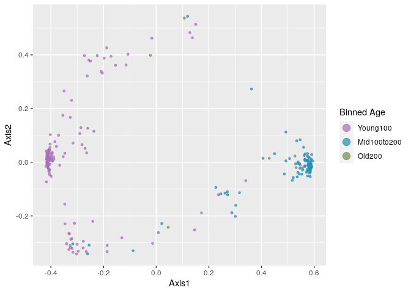<!-- -->
On revient sur nos échantillons de fôrets. Il a été calculé la distance
entre les échantillons en fonction de leur fréquence d’apparition. Si
deux échantillons sont produits dans la même partition, alors la
distance résultante est faible. Ces distances sont rentrées dans le
PCoA. On observe une nette séparation entre les âges moyens et les
jeunes.

``` r
as.vector(tax_table(ps)[which.max(importance(rfFit$finalModel)), c("Family", "Genus")])
```

    ## [1] "Erysipelotrichaceae" "Turicibacter"

On identifie la bactérie qui a le plus d’influence lors de la prédiction
des fôrets aléatoires.

## Abondance discriminative des bactéries dans des échantillons d’arbres à des âges différents

``` r
impOtu <- as.vector(otu_table(pslog)[,which.max(importance(rfFit$finalModel))])
maxImpDF <- data.frame(sample_data(pslog), abund = impOtu)
ggplot(maxImpDF) +   geom_histogram(aes(x = abund)) +
  facet_grid(age2 ~ .) +
  labs(x = "Abundance of discriminative bacteria", y = "Number of samples")
```

    ## `stat_bin()` using `bins = 30`. Pick better value with `binwidth`.

<!-- -->
On montre l’abondance du Lachnospiraceae dans nos échantillons. On peut
voir un pic chez les jeunes mais il n’est pas uniformément répartie
entre les autres fôrets. Pour les plus âgées, cette bactérie est
retrouvée plus souvent.

# Analyses graphiques

## Création et traçage des graphiques : où viennent les souris, de quel échantillon…

``` r
library("phyloseqGraphTest")
library("igraph")
```

    ## 
    ## Attaching package: 'igraph'

    ## The following object is masked from 'package:vegan':
    ## 
    ##     diversity

    ## The following object is masked from 'package:permute':
    ## 
    ##     permute

    ## The following objects are masked from 'package:dplyr':
    ## 
    ##     as_data_frame, groups, union

    ## The following object is masked from 'package:phangorn':
    ## 
    ##     diversity

    ## The following objects are masked from 'package:ape':
    ## 
    ##     edges, mst, ring

    ## The following object is masked from 'package:Biostrings':
    ## 
    ##     union

    ## The following object is masked from 'package:XVector':
    ## 
    ##     path

    ## The following object is masked from 'package:IRanges':
    ## 
    ##     union

    ## The following object is masked from 'package:S4Vectors':
    ## 
    ##     union

    ## The following objects are masked from 'package:BiocGenerics':
    ## 
    ##     normalize, path, union

    ## The following objects are masked from 'package:stats':
    ## 
    ##     decompose, spectrum

    ## The following object is masked from 'package:base':
    ## 
    ##     union

``` r
library("ggnetwork")
net <- make_network(ps, max.dist=0.35)
sampledata <- data.frame(sample_data(ps))
V(net)$id <- sampledata[names(V(net)), "host_subject_id"]
V(net)$litter <- sampledata[names(V(net)), "family_relationship"]
net_graph <- ggnetwork(net)
ggplot(net_graph, aes(x = x, y = y, xend = xend, yend = yend), layout = "fruchtermanreingold") +
  geom_edges(color = "darkgray") +
  geom_nodes(aes(color = id, shape = litter),  size = 3 ) +
  theme(axis.text = element_blank(), axis.title = element_blank(),
        legend.key.height = unit(0.5,"line")) +
  guides(col = guide_legend(override.aes = list(size = .5)))
```

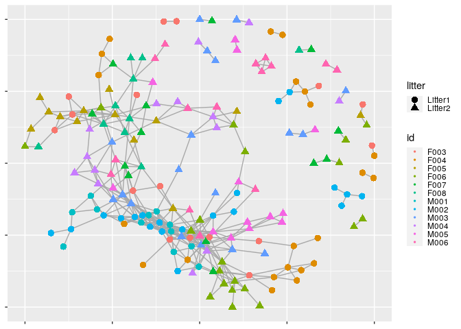<!-- -->
On trace un graphique en réseau avec un seuil de dissimilarité de
Jaccard de 0.35. La forme des points indique de quelles portées viennent
les souris et la couleur montre la provenance de l’échantillon. Il y a
des regroupements des échantillons par souris et par portées.

## Graphiques basées sur le test de deux échantillons : Minimum Spanning Tree (MST)

``` r
gt <- graph_perm_test(ps, "family_relationship", grouping = "host_subject_id",
                      distance = "jaccard", type = "mst")
gt$pval
```

    ## [1] 0.004

Imbrication de la structure. Les données des individus sont regroupées
et il ne faudrait pas que cela se casse. C’est pourquoi on indique qu’on
garde cette structure quand on permutera les étiquettes.

``` r
plotNet1=plot_test_network(gt) + theme(legend.text = element_text(size = 8),
        legend.title = element_text(size = 9))
plotPerm1=plot_permutations(gt)
grid.arrange(ncol = 2,  plotNet1, plotPerm1)
```

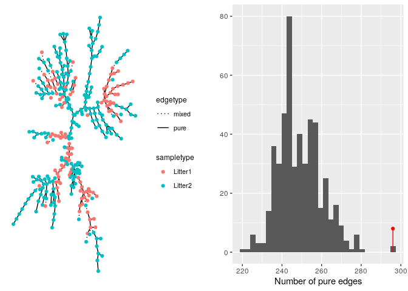<!-- -->
On peut voir que les échantillons se regroupent plus par portée que l’on
pouvait imaginé au début. Il y a une bonne similarité entre les souris
venant d’une même portée.

## Nearest neighbors : if a pair of samples has an edge between them in the nearest neighbor graph, they are overwhelmingly likely to be in the same litter

``` r
gt <- graph_perm_test(ps, "family_relationship", grouping = "host_subject_id",
                      distance = "jaccard", type = "knn", knn = 1)
plotNet2=plot_test_network(gt) + theme(legend.text = element_text(size = 8),
        legend.title = element_text(size = 9))
plotPerm2=plot_permutations(gt)
grid.arrange(ncol = 2,  plotNet2, plotPerm2)
```

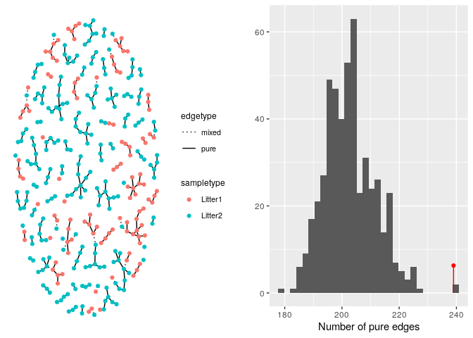<!-- -->
Les graphiques montrent que les paires d’échantillons ayant un lien
entre eux, il est fort probable qu’ils viennent d’une même portée.

## Modélisation linéaire: Diversité de Shannon associé à chaque échantillon et joint avec annotation de l’échantillon

``` r
library("nlme")
```

    ## 
    ## Attaching package: 'nlme'

    ## The following object is masked from 'package:dplyr':
    ## 
    ##     collapse

    ## The following object is masked from 'package:Biostrings':
    ## 
    ##     collapse

    ## The following object is masked from 'package:IRanges':
    ## 
    ##     collapse

``` r
library("reshape2")
ps_alpha_div <- estimate_richness(ps, split = TRUE, measure = "Shannon")
ps_alpha_div$SampleID <- rownames(ps_alpha_div) %>%
  as.factor()
ps_samp <- sample_data(ps) %>%
  unclass() %>%
  data.frame() %>%
  left_join(ps_alpha_div, by = "SampleID") %>%
  melt(measure.vars = "Shannon",
       variable.name = "diversity_measure",
       value.name = "alpha_diversity")

diversity_means <- ps_samp %>%
  group_by(host_subject_id) %>%
  summarise(mean_div = mean(alpha_diversity)) %>%
  arrange(mean_div)
```

    ## `summarise()` ungrouping output (override with `.groups` argument)

``` r
ps_samp$host_subject_id <- factor(ps_samp$host_subject_id)
#                                  diversity_means$host_subject_id)

alpha_div_model <- lme(fixed = alpha_diversity ~ age_binned, data = ps_samp,
                       random = ~ 1 | host_subject_id)

new_data <- expand.grid(host_subject_id = levels(ps_samp$host_subject_id),
                        age_binned = levels(ps_samp$age_binned))
new_data$pred <- predict(alpha_div_model, newdata = new_data)
X <- model.matrix(eval(eval(alpha_div_model$call$fixed)[-2]),
                  new_data[-ncol(new_data)])
pred_var_fixed <- diag(X %*% alpha_div_model$varFix %*% t(X))
new_data$pred_var <- pred_var_fixed + alpha_div_model$sigma ^ 2

ggplot(ps_samp %>% left_join(new_data)) +
  geom_errorbar(aes(x = age_binned, ymin = pred - 2 * sqrt(pred_var),
                    ymax = pred + 2 * sqrt(pred_var)),
                col = "#858585", size = .1) +
  geom_point(aes(x = age_binned, y = alpha_diversity,
                 col = family_relationship), size = 0.8) +
  facet_wrap(~host_subject_id) +
  scale_y_continuous(limits = c(2.4, 4.6), breaks = seq(0, 5, .5)) +
  scale_color_brewer(palette = "Set2") +
  labs(x = "Binned Age", y = "Shannon Diversity", color = "Litter") +
  guides(col = guide_legend(override.aes = list(size = 4))) +
  theme(panel.border = element_rect(color = "#787878", fill = alpha("white", 0)),
        axis.text.x = element_text(angle = -90, size = 6),
        axis.text.y = element_text(size = 6))
```

    ## Joining, by = c("host_subject_id", "age_binned")

<!-- -->
Sur ces graphiques, on observe la diversité, la richesse, des
échantillons dans les différentes portées et chez les souris dont l’âge
est différents. Pour M004, on observe une grande diversité chez les
souris d’âge jeune et moyen mais une diversité très faible chez les
souris âgées. On peut voir également que certains échantillons ne sont
présents que dans une seule portée spécifique.

## Hiéarchisation des tests multiples

``` r
library("reshape2")
library("DESeq2")
```

    ## Loading required package: GenomicRanges

    ## Loading required package: GenomeInfoDb

    ## Loading required package: SummarizedExperiment

    ## Loading required package: MatrixGenerics

    ## Loading required package: matrixStats

    ## 
    ## Attaching package: 'matrixStats'

    ## The following object is masked from 'package:dplyr':
    ## 
    ##     count

    ## 
    ## Attaching package: 'MatrixGenerics'

    ## The following objects are masked from 'package:matrixStats':
    ## 
    ##     colAlls, colAnyNAs, colAnys, colAvgsPerRowSet, colCollapse,
    ##     colCounts, colCummaxs, colCummins, colCumprods, colCumsums,
    ##     colDiffs, colIQRDiffs, colIQRs, colLogSumExps, colMadDiffs,
    ##     colMads, colMaxs, colMeans2, colMedians, colMins, colOrderStats,
    ##     colProds, colQuantiles, colRanges, colRanks, colSdDiffs, colSds,
    ##     colSums2, colTabulates, colVarDiffs, colVars, colWeightedMads,
    ##     colWeightedMeans, colWeightedMedians, colWeightedSds,
    ##     colWeightedVars, rowAlls, rowAnyNAs, rowAnys, rowAvgsPerColSet,
    ##     rowCollapse, rowCounts, rowCummaxs, rowCummins, rowCumprods,
    ##     rowCumsums, rowDiffs, rowIQRDiffs, rowIQRs, rowLogSumExps,
    ##     rowMadDiffs, rowMads, rowMaxs, rowMeans2, rowMedians, rowMins,
    ##     rowOrderStats, rowProds, rowQuantiles, rowRanges, rowRanks,
    ##     rowSdDiffs, rowSds, rowSums2, rowTabulates, rowVarDiffs, rowVars,
    ##     rowWeightedMads, rowWeightedMeans, rowWeightedMedians,
    ##     rowWeightedSds, rowWeightedVars

    ## Loading required package: Biobase

    ## Welcome to Bioconductor
    ## 
    ##     Vignettes contain introductory material; view with
    ##     'browseVignettes()'. To cite Bioconductor, see
    ##     'citation("Biobase")', and for packages 'citation("pkgname")'.

    ## 
    ## Attaching package: 'Biobase'

    ## The following object is masked from 'package:MatrixGenerics':
    ## 
    ##     rowMedians

    ## The following objects are masked from 'package:matrixStats':
    ## 
    ##     anyMissing, rowMedians

    ## The following object is masked from 'package:phyloseq':
    ## 
    ##     sampleNames

``` r
sample_data(ps)$age_binned <- cut(sample_data(ps)$age,
                          breaks = c(0, 100, 200, 400))
levels(sample_data(ps)$age_binned) <- list(Young100="(0,100]", Mid100to200="(100,200]", Old200="(200,400]")
sample_data(ps)$family_relationship = gsub(" ", "", sample_data(ps)$family_relationship)
ps_dds <- phyloseq_to_deseq2(ps, design = ~ age_binned + family_relationship)
```

    ## converting counts to integer mode

    ## Warning in DESeqDataSet(se, design = design, ignoreRank): some variables in
    ## design formula are characters, converting to factors

``` r
geo_mean_protected <- function(x) {
  if (all(x == 0)) {
    return (0)
  }
  exp(mean(log(x[x != 0])))
}

geoMeans <- apply(counts(ps_dds), 1, geo_mean_protected)
ps_dds <- estimateSizeFactors(ps_dds, geoMeans = geoMeans)
ps_dds <- estimateDispersions(ps_dds)
```

    ## gene-wise dispersion estimates

    ## mean-dispersion relationship

    ## final dispersion estimates

``` r
abund <- getVarianceStabilizedData(ps_dds)
```

## DESeq2 transformation abondance

``` r
short_names <- substr(rownames(abund), 1, 5)%>%
  make.names(unique = TRUE)
rownames(abund) <- short_names
abund_sums <- rbind(data.frame(sum = colSums(abund),
                               sample = colnames(abund),
                               type = "DESeq2"),
                    data.frame(sum = rowSums(otu_table(pslog)),
                               sample = rownames(otu_table(pslog)),
                               type = "log(1 + x)"))

ggplot(abund_sums) +
  geom_histogram(aes(x = sum), binwidth = 20) +
  facet_grid(type ~ .) +
  xlab("Total abundance within sample")
```

<!-- -->
Comparaison des transformations DESeq2 et log(1+x)(transformation
facilitée. On observe l’abondance totale des échantillons par
l’utilisation des deux méthodes de transformation. Il y a certaines
similitudes mais des différences prononcées entre ces deux échantillons.
DESeq2 donne plus de résultats pour les abondances moyennes et faibles.
Le log écrase les données faible, donc les résultats sont moins
flagrants.

``` r
library("structSSI")
el <- phy_tree(pslog)$edge
el0 <- el
el0 <- el0[nrow(el):1, ]
el_names <- c(short_names, seq_len(phy_tree(pslog)$Nnode))
el[, 1] <- el_names[el0[, 1]]
el[, 2] <- el_names[as.numeric(el0[, 2])]
unadj_p <- treePValues(el, abund, sample_data(pslog)$age_binned)
```

Utilisation des tests Univariés sur chaque groupes taxonomiques,
permettant une hiérarchisation.

## Correction p-value

``` r
hfdr_res <- hFDR.adjust(unadj_p, el, .75)
summary(hfdr_res)
```

    ## Number of hypotheses: 764 
    ## Number of tree discoveries: 579 
    ## Estimated tree FDR: 1 
    ## Number of tip discoveries: 280 
    ## Estimated tips FDR: 1 
    ## 
    ##  hFDR adjusted p-values: 
    ##                 unadjp         adjp adj.significance
    ## GCAAG.95  1.861873e-82 3.723745e-82              ***
    ## GCAAG.70  1.131975e-75 2.263950e-75              ***
    ## GCAAG.187 5.148758e-59 1.029752e-58              ***
    ## GCAAG.251 3.519276e-50 7.038553e-50              ***
    ## GCAAG.148 1.274481e-49 2.548962e-49              ***
    ## GCAAG.30  9.925218e-49 1.985044e-48              ***
    ## GCGAG.76  1.722591e-46 3.445183e-46              ***
    ## GCAAG.167 6.249050e-43 1.249810e-42              ***
    ## 255       8.785479e-40 1.757096e-39              ***
    ## GCAAG.64  2.727610e-36 5.455219e-36              ***
    ## [only 10 most significant hypotheses shown] 
    ## --- 
    ## Signif. codes:  0 '***' 0.015 '**' 0.15 '*' 0.75 '.' 1.5 '-' 1

Par l’utilisation du test hiérarchique, nous pouvons corriger la p-value
pour permettre d’affiner nos résultats (résultats plus significatifs).

## Show a screenshot of a subtree with many differentially abundant bacteria, as determined by the hierarchical testing procedure.

``` r
plot(hfdr_res, height = 5000)
```

Un onglet s’ouvre mais le graphique n’apparait pas. On devrait un arbre
contenant des bactéries de différentes abondances. La p-value s’affiche
quand on passe sur un des points. Les couleurs indiquent la puissance
des associations.

``` r
tax <- tax_table(pslog)[, c("Family", "Genus")] %>%
  data.frame()
tax$seq <- short_names
options(digits=3)
hfdr_res@p.vals$seq <- rownames(hfdr_res@p.vals)
tax %>%
  left_join(hfdr_res@p.vals) %>%
  arrange(adjp) %>% head(10)
```

    ## Joining, by = "seq"

    ##             Family            Genus       seq   unadjp     adjp
    ## 1  Lachnospiraceae             <NA>  GCAAG.95 1.86e-82 3.72e-82
    ## 2  Lachnospiraceae        Roseburia  GCAAG.70 1.13e-75 2.26e-75
    ## 3  Lachnospiraceae Clostridium_XlVa GCAAG.187 5.15e-59 1.03e-58
    ## 4  Lachnospiraceae             <NA> GCAAG.251 3.52e-50 7.04e-50
    ## 5  Lachnospiraceae Clostridium_XlVa GCAAG.148 1.27e-49 2.55e-49
    ## 6  Lachnospiraceae             <NA>  GCAAG.30 9.93e-49 1.99e-48
    ## 7  Ruminococcaceae     Ruminococcus  GCGAG.76 1.72e-46 3.45e-46
    ## 8  Lachnospiraceae Clostridium_XlVa GCAAG.167 6.25e-43 1.25e-42
    ## 9  Lachnospiraceae        Roseburia  GCAAG.64 2.73e-36 5.46e-36
    ## 10            <NA>             <NA>   GCAAG.1 5.22e-35 1.04e-34
    ##    adj.significance
    ## 1               ***
    ## 2               ***
    ## 3               ***
    ## 4               ***
    ## 5               ***
    ## 6               ***
    ## 7               ***
    ## 8               ***
    ## 9               ***
    ## 10              ***

Les bactéries les plus fortement associées sont les Lachnospiraceae, ce
qui est cohérent avec les résultats obtenus auparavant avec les fôrets.

# Utilisation des multi-tables

``` r
metab <- read.csv("https://raw.githubusercontent.com/spholmes/F1000_workflow/master/data/metabolites.csv",row.names = 1)
microbe_connect <-url("https://raw.githubusercontent.com/spholmes/F1000_workflow/master/data/microbe.rda")
load(microbe_connect)
microbe
```

    ## phyloseq-class experiment-level object
    ## otu_table()   OTU Table:         [ 20609 taxa and 12 samples ]
    ## tax_table()   Taxonomy Table:    [ 20609 taxa by 6 taxonomic ranks ]
    ## phy_tree()    Phylogenetic Tree: [ 20609 tips and 20607 internal nodes ]

On télécharge de nouvelles données pour permettre de faire l’ACC
(Analyse Canonique des Correspondances). On affiche l’objet PhyloSeq
associé à ces données.

``` r
library("genefilter")
```

    ## 
    ## Attaching package: 'genefilter'

    ## The following objects are masked from 'package:MatrixGenerics':
    ## 
    ##     rowSds, rowVars

    ## The following objects are masked from 'package:matrixStats':
    ## 
    ##     rowSds, rowVars

``` r
keep_ix <- rowSums(metab == 0) <= 3
metab <- metab[keep_ix, ]
microbe <- prune_taxa(taxa_sums(microbe) > 4, microbe)
microbe <- filter_taxa(microbe, filterfun(kOverA(3, 2)), TRUE)
metab <- log(1 + metab, base = 10)
X <- otu_table(microbe)
X[X > 50] <- 50
dim(X)
```

    ## [1] 174  12

On filtre les données en ne gardant que les microbes (X) et les
métabolites d’intêrets (metab). On observe pour X, 174 lignes (ce sont
les microbes) et 12 colonnes (qui correspondent aux échantillons)

``` r
dim(metab)
```

    ## [1] 405  12

On observe pour metab, 405 lignes (les métabolites d’intêrets) et 12
colonnes (échantillons)

``` r
library(PMA)
cca_res <- CCA(t(X),  t(metab), penaltyx = .15, penaltyz = .15)
```

    ## 123456789101112131415

Penaltyx (nombre de microbe) et Penaltyz (nombre de métabolites
d’intêrets) sont des pénalités de parcimonie. Plus leur valeur est
faible, plus le nombre de microbe et métabolite diminue. On fait une
sélection des microbes et des métabolites pour la réalisation de la PCA
(Principal Component Analysis)

``` r
cca_res
```

    ## Call: CCA(x = t(X), z = t(metab), penaltyx = 0.15, penaltyz = 0.15)
    ## 
    ## 
    ## Num non-zeros u's:  5 
    ## Num non-zeros v's:  15 
    ## Type of x:  standard 
    ## Type of z:  standard 
    ## Penalty for x: L1 bound is  0.15 
    ## Penalty for z: L1 bound is  0.15 
    ## Cor(Xu,Zv):  0.974

On a retenu 5 microbes et 15 métabolites. Ces données nous permettent
d’expliquer la covariation entre les deux tableaux. Ces 20
caractéristiques montrent une corrélarion de 0,97, signifiant qu’il y a
des signaux similaires entre ces deux tableaux, et les 20
caractéristiques sélectionnées peuvent montrer avec une bonne confiance
ces signaux.

``` r
combined <- cbind(t(X[cca_res$u != 0, ]),
                  t(metab[cca_res$v != 0, ]))
pca_res <- dudi.pca(combined, scannf = F, nf = 3)

genotype <- substr(rownames(pca_res$li), 1, 2)
sample_type <- substr(rownames(pca_res$l1), 3, 4)
feature_type <- grepl("\\.", colnames(combined))
feature_type <- ifelse(feature_type, "Metabolite", "OTU")
sample_info <- data.frame(pca_res$li, genotype, sample_type)
feature_info <- data.frame(pca_res$c1,
                           feature = substr(colnames(combined), 1, 6))

ggplot() +  geom_point(data = sample_info,
            aes(x = Axis1, y = Axis2, col = sample_type, shape = genotype), size = 3) + 
  geom_label_repel(data = feature_info,
                   aes(x = 5.5 * CS1, y = 5.5 * CS2, label = feature, fill = feature_type),
                   size = 2, segment.size = 0.3,
                   label.padding = unit(0.1, "lines"), label.size = 0) +
  geom_point(data = feature_info,
             aes(x = 5.5 * CS1, y = 5.5 * CS2, fill = feature_type),
             size = 1, shape = 23, col = "#383838") +
  scale_color_brewer(palette = "Set2") +
  scale_fill_manual(values = c("#a6d854", "#e78ac3")) +
  guides(fill = guide_legend(override.aes = list(shape = 32, size = 0))) +
  coord_fixed(sqrt(pca_res$eig[2] / pca_res$eig[2])) +
  labs(x = sprintf("Axis1 [%s%% Variance]",
                   100 * round(pca_res$eig[1] / sum(pca_res$eig), 2)),
       y = sprintf("Axis2 [%s%% Variance]",
                   100 * round(pca_res$eig[2] / sum(pca_res$eig), 2)),
       fill = "Feature Type", col = "Sample Type")
```

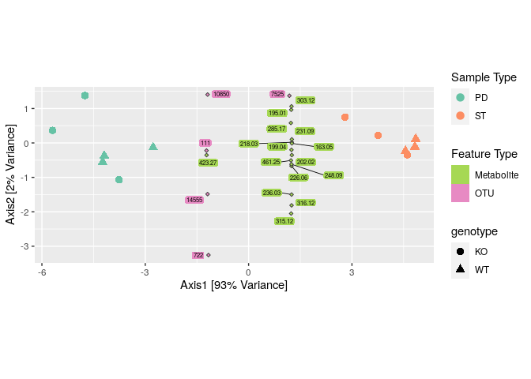<!-- -->
On a utiliser les 20 caractéristiques précédentes pour comprimer les
données du tableau. Le graphe montre différents types d’échantillons,
les métabolites et les OTUs. On compare les échantillons qui ont été
mesurés et les influences que peuvent avoir certains facteurs sur les
métaboites et OTU. Par exemple, il y a de grande variation entre PD et
ST, qui correspondent à des régimes alimentaires différents.
